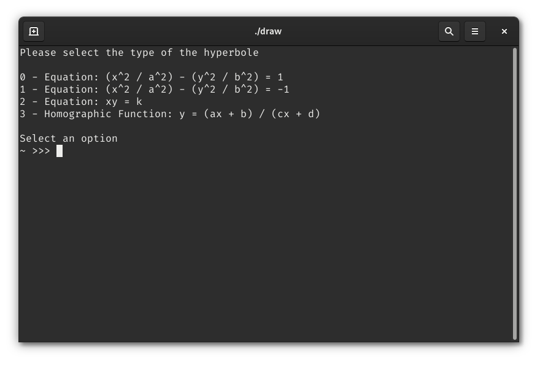
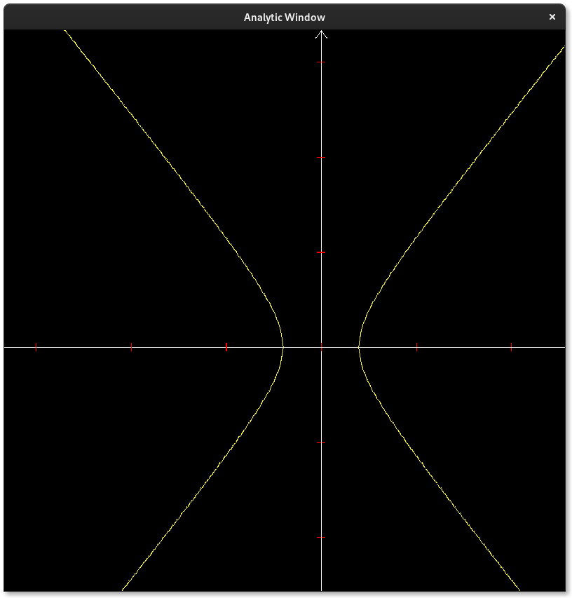

# Analytic

[](https://github.com/MarcoMihaiCondrache/Analytic)

Analytic, a simple program for the graphic representation of the most common geometric places: Straight lines,
Circumferences, Hyperbolas and Parables

The program uses 3 external libraries two of which were written by me

## Compiling

UNIX Systems

```bash
$ mkdir cmake-build-release
$ cd cmake-build-release
$ cmake -DCMAKE_BUILD_TYPE=Release ..
$ cmake --build
```

If cmake doesn't find SDL2 please specify the path as following.

```bash
$ cmake -DCMAKE_BUILD_TYPE=Release -DSDL2_PATH="/path/to/sdl2" ..
```

## Execute

UNIX Systems

```bash
$ cd cmake-build-release
$ chmod u+x Analytic
$ ./Analytic
```

## Demo

Main Menu




Default Window without zoom


Default Window with zoom



## Documentation

The default documentation can be found in the [docs](https://github.com/MarcoMihaiCondrache/Analytic/tree/master/docs)
folder

## Tests Documentation

The program has been tested extensively and effectively.

Tests were performed regarding input management, mathematical calculations (prevention of exceptions at runtime),
management of external events (such as forced closure by the system), output management and forced rendering.

These are the results obtained from the script executed under perl environment:

- Input Handling (Vote 10)
    - The program handles incorrect input correctly, ignoring user errors and proposing the request again
- Mathematical calculations management (Vote 9)
    - The program correctly manages the mathematical calculations, the tests were performed with negative, positive and
      comma numbers. Any domain errors or impossible results are recognized but not resolved, so the user will be
      informed of the problem but the program will stop.
- External events management (Vote 10)
    - The program reacts correctly to external indications: it does not slow down the system in any way and responds
      correctly to events such as clicking, scrolling and closing the program
    - Internal events such as the inability to create windows or write to files are handled correctly
- Output management (Vote 8)
    - The program has safe APIs for managing the output even if at times it could present some graphic glitch due to the
      system on which it is run. (Lack of unicode support)
- Rendering and performace (Vote 9.5)
    - The program has been pushed to the maximum, managing to guarantee stability even with calculations with 6 digits
      after the comma (point by point increasing by 0.000001), obviously with such large calculations the demand for
      resources increases even if not in an exaggerated way. Furthermore, thanks to the use of the SDL library, there is
      no problem with rendering on different platforms. The graphic rendering has been tested both using OpenGL and
      Vulkan.

## Development

### Contributing

Long-term discussion and bug reports are maintained via GitHub Issues. Code review is done via GitHub Pull Requests.

### Special thanks

Thanks a lot for the [log](https://github.com/rxi/log.c) library offered by [rxi](https://github.com/rxi)
